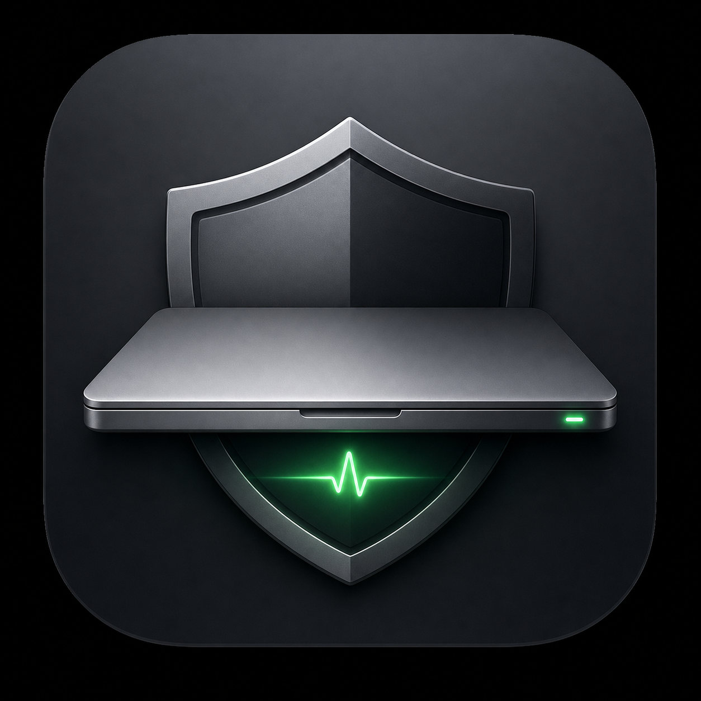

# Clamshell

<p align="center">
  
</p>

Close your Mac. Let the job finish. Sleep when done.

Clamshell is a tiny macOS menu bar app for developers running long AI coding jobs on a MacBook. Flip it on, close the lid, and Clamshell keeps the Mac awake only while watched jobs are active.

Unofficial, local-only, and not affiliated with OpenAI or Anthropic.

<p align="center">
  
  
</p>

Stop babysitting the screen. Clamshell watches local Codex activity, holds sleep while work is active, then restores normal sleep behavior when the last job settles.

## Install

Source install in one line:

```bash
git clone --depth 1 https://github.com/jtc268/clamshell.git && cd clamshell && ./install.sh
```

From a checkout:

```bash
./install.sh
```

## Watches

- Codex App
- Codex CLI
- Claude Code CLI

Codex App is on by default. Codex CLI is on by default. Claude Code CLI is optional.

## How It Works

- Polls local process state every eight seconds.
- Checks recent Codex session writes under `~/.codex`.
- Holds sleep only while a watched job is active.
- Uses a five-minute settle window before deciding work is done.
- Restores `pmset` sleep behavior before triggering sleep.
- No daemon, launch item, login item, updater, or background service.

Codex App detection is heuristic because there is no public local job API. The hook intentionally does not treat an open Codex window as active; it requires the app-server plus recent Codex session-file writes inside the settle window.

Codex CLI detection also avoids treating an idle `codex` process as active. It ignores Codex Terminal wrapper processes and looks for CLI child work or recent Codex session activity.

## Why Trust It

- Native Swift menu bar app.
- No network calls.
- No telemetry.
- No private APIs.
- Local process and session-file detection only.
- 57-line helper with four allowlisted `pmset` commands.

The helper is needed because normal macOS wake assertions do not reliably survive a closed MacBook lid. It is installed at `/usr/local/libexec/clamshell-helper`, accepts only `enable`, `disable`, `sleepnow`, and `status`, and wraps only:

- `pmset -a disablesleep 1`
- `pmset -a disablesleep 0`
- `pmset sleepnow`
- `pmset -g`

That is the privileged surface. If you are not comfortable with a small setuid helper for `pmset`, do not install Clamshell.

## Build

```bash
make smoke
```

## Uninstall

Quit Clamshell, drag `/Applications/Clamshell.app` to the Trash, then remove the helper:

```bash
[ ! -e /usr/local/libexec/clamshell-helper ] || sudo /bin/rm /usr/local/libexec/clamshell-helper
```

## Details

See [docs/DETECTION.md](docs/DETECTION.md).
